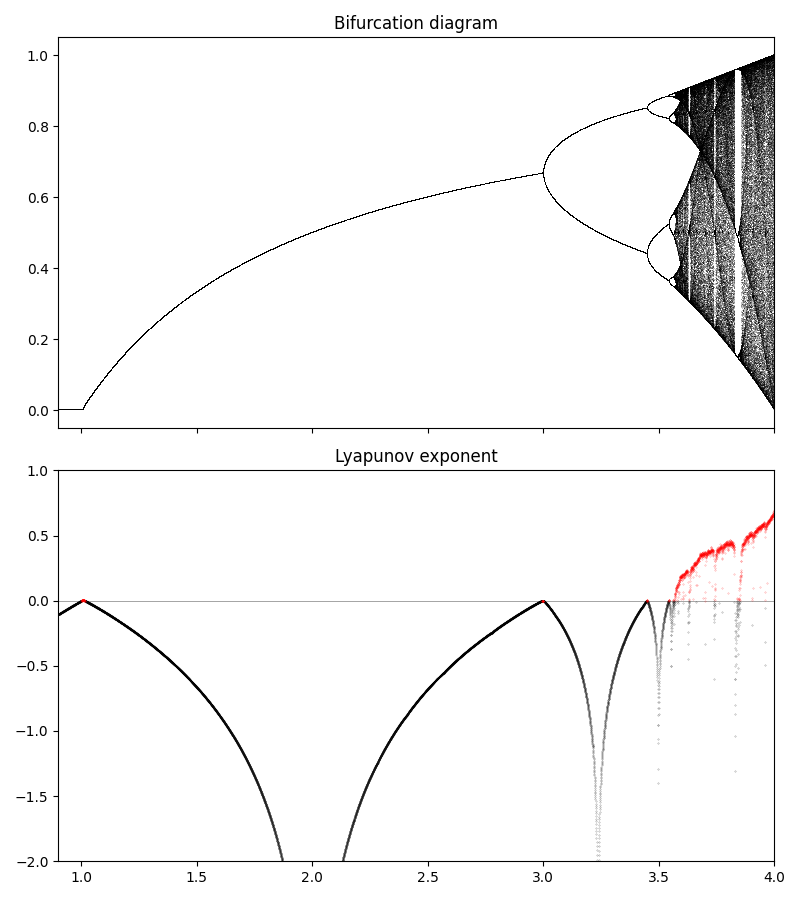

# Feigenbaum Constant Calculation for Chaotic Renormalization-Group Flows in Spin Glasses

:: WARNING ::  
THIS IS AN ONGOING PROJECT, THE CODE IS NOT COMPLETE
-

## Table of Contents

- [Introduction](#introduction)
- [Theoretical Background](#theoretical-background)
- [Features](#features)
- [Methodology](#methodology)
- [License](#license)
- [Contact](#contact)

## Introduction

This repository contains the implementation for calculating the **Feigenbaum constant** within the context of **chaotic renormalization-group (RG) flows**. The primary focus is to investigate **universality** in **spin glasses**, which are disordered magnetic systems exhibiting complex energy landscapes and chaotic behavior under RG transformations.

Understanding the Feigenbaum constant in this setting provides deeper insights into the universal properties of phase transitions and critical phenomena in disordered systems. This project leverages computational methods to analyze chaotic time series generated from RG flows, aiming to identify and quantify universal scaling behaviors.

## Theoretical Background

### Feigenbaum Constants and Universality

The **Feigenbaum constants** are universal numerical values that quantify the geometric scaling of period-doubling bifurcations in nonlinear dynamical systems leading to chaos. There are two primary constants:

- **Feigenbaum Delta (δ)**: Describes the rate at which the parameter values converge to the accumulation point of period-doubling bifurcations.
- **Feigenbaum Alpha (α)**: Relates to the scaling of the widths of the bifurcation intervals.

These constants are universal for a wide class of one-dimensional maps with a single quadratic maximum, indicating that different systems exhibit the same scaling behavior near the onset of chaos.

### Chaotic RG Flows in Spin Glasses

In the context of **spin glasses**, the RG transformations can exhibit chaotic behavior due to the complex interactions and frustration inherent in these systems. Studying the Feigenbaum constants within RG flows allows us to:

- **Identify Universal Scaling Laws**: Determine if spin glasses exhibit universal behavior analogous to simpler dynamical systems.
- **Understand Phase Transitions**: Gain insights into the nature of phase transitions in disordered systems.
- **Explore Critical Phenomena**: Investigate how microscopic interactions lead to macroscopic chaotic behavior.

### Visualization of Bifurcation and Chaos

Below is a schematic representation of a bifurcation diagram illustrating period-doubling leading to chaos:

  

*Figure: A bifurcation diagram showing period-doubling bifurcations leading to chaos. The Feigenbaum constants describe the scaling properties of these bifurcations.*

## Features

- **Chaotic Time Series Generation**: Simulates RG flows for various spin glass models to generate chaotic time series data.
- **Feigenbaum Constant Calculation**: Implements algorithms to accurately compute the Feigenbaum constant from the generated time series.
- **Universality Analysis**: Tools to compare Feigenbaum constants across different models and identify universal patterns.
- **Visualization**: Provides scripts to visualize RG flows, bifurcation diagrams, and scaling behaviors.
- **Modular Design**: Easily extendable framework to incorporate additional models or computational methods.

## Methodology

The project employs the following methodology:

1. **Model Selection**: Choose appropriate spin glass models that exhibit chaotic RG flows.
2. **RG Transformation**: Apply renormalization-group transformations iteratively to generate time series data.
3. **Chaos Analysis**: Analyze the resulting time series to identify chaotic behavior and bifurcations.
4. **Feigenbaum Calculation**: Utilize numerical methods to calculate the Feigenbaum constant from the bifurcation patterns.
5. **Universality Study**: Compare the calculated constants across different models to investigate universality.

## License

This project is licensed under the [MIT License](LICENSE).

## Contact

For questions or suggestions, please contact <artun@mail.com>.